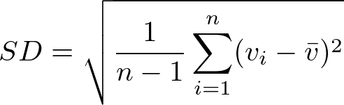

```{r global_options, include=FALSE}
knitr::opts_chunk$set(#fig.width=12, fig.height=8
    echo=FALSE, warning=FALSE, message=FALSE)
```


```{R}

set.seed(793230)

avg_velocity_true = 2900
sd_true = 10
n = 2

obs = rnorm(n, avg_velocity_true, sd_true)

avg_velocity_estimate = mean(obs)
sd_estimate = sd(obs)

read_hornady = function(fname)
{
    # Read a spreadsheet produced by
    # http://www.hornady.com/ballistics-resource/4dof
    out = read.table(fname, header = FALSE, skip = 3L
            , sep = ",", stringsAsFactors = FALSE)
    nm = read.table(fname, sep = ",", skip = 1L, nrows = 2L
            , stringsAsFactors = FALSE)
    with_unit = paste0(nm[1, ], nm[2, ])
    with_unit = gsub("[[:space:]]+$", "", with_unit)
    colnames(out) = with_unit
    out
}

diff = function(hi, low)
{
    hi = read_hornady(hi)
    low = read_hornady(low)
    low[, "ComeUp(MOA)"] - hi[, "ComeUp(MOA)"]
}


```

__Standard Deviation__ (SD) measures the consistency of the velocity of
ammunition.  Small SD values mean that velocity is consistent. Large SD
values mean that the velocities are inconsistent. Inconsistent velocity
manifests itself as vertical stringing at distance. Slower bullets take
longer to get to the target and they drop more. As any handloader will tell
you, consistency is accuracy.

Firing more round through a chronograph will give you a more accurate
estimate of SD. However, Every round fired requires time to
load, money for the components, and wears down the barrel. 
Which brings us to the question this article addresses.

_Question:_

> How many rounds do I need to fire to accurately estimate SD?
> What is the point of diminishing returns? 5 rounds? 9 rounds?

_Answer:_

__It depends.__

To understand this answer we return to _why_ we care about SD. Our goal is
to know where in the vertical plane the rounds will impact so we can dial
the correct elevation in the scope. In particular we need to know what the
velocity of the _next_ round from a given lot will be, since if we knew
this we could use a ballistic calculator to compute an exact solution. 

Since we can't possibly know the exact velocity of a round before it is
fired we turn to statistics to provide us with reasonable upper and lower
bounds based on the data we've observed so far. This is the idea of a
[prediction interval](https://robjhyndman.com/hyndsight/intervals/).  If SD
is known then a quick and dirty formula for a 95% prediction interval is
$(v - 2*SD, v
+ 2*SD)$.  This means that if the shooter repeats this process many times
  for many different lots of ammunition then approximately 95% of the
  predicted velocities will be inside this interval.

For example, if average velocity is 2720 ft/s and SD is 10 ft/s then a 95%
confidence interval for the next round is (2700, 2740). For a 140 grain 6.5
Creedmoor this velocity difference translates to a 0.5 MOA vertical spread
at 600 yards. So if you have a perfect hold on a perfect gun on a perfect
clear day with no wind and you're aiming at the 0.5 MOA X ring on an F
class target then you can expect on average 95% or 19 / 20 shots to impact
in the vertical region of the X ring.

In reality these other sources of variability are rarely perfect. So if
you're competitive then you may well benefit from shrinking SD down from 10
to 5 ft/s to cut your ammunition's vertical dispersion in half.

The following charts illustrate the ideas for two common cartridges. All
data was generated using the [Hornady 4DOF ballistic
calculator](http://www.hornady.com/ballistics-resource/4dof) based on
Hornady's ELD Match bullets available in the drop down menu. The plot also
shows the effect of a 1 and 2 mph cross wind for comparison.


```{R}

ideal = read_hornady("data/6.5_140_2720.csv")
Range = ideal$Range
wind = ideal[, "WindDrift(MOA)"] / 10
sd5 = diff("data/6.5_140_2710.csv", "data/6.5_140_2730.csv")
sd10 = diff("data/6.5_140_2700.csv", "data/6.5_140_2740.csv")
sd20 = diff("data/6.5_140_2680.csv", "data/6.5_140_2760.csv")

plot_sd = function(...)
{
    ylim = range(wind, sd20)
    plot(range(Range), ylim, type = "n"
        , main = "Prediction intervals according to velocity SD"
        , xlab = "Distance (yards)"
        , ylab = "Size of 95% prediction interval (MOA)"
        , ...
        )
    lines(Range, ideal[, "WindDrift(MOA)"] / 10)
    lines(Range, ideal[, "WindDrift(MOA)"] / 5, lty = 2)
    points(Range, sd5)
    points(Range, sd10, pch = 2)
    points(Range, sd20, pch = 3)
    legend("topleft", legend = c("sd 5 ft/s", "sd 10 ft/s", "sd 20 ft/s")
        , pch = 1:3)
    legend("topright", legend = c("1 Mph wind", "2 Mph wind"), lty = 1:2
        , bg = "white")
    abline(h = 1, col = scales::alpha("blue", 0.5))
    abline(h = 0.5, col = scales::alpha("blue", 0.5))
}

plot_sd(sub = "For 140 gr 6.5 Creedmoor at 2720 ft/s")
```

This plot shows the effect of three different SD values for a 6.5
Creedmoor. Ammo that has an SD of 20 ft/s opens up to a 0.5 MOA vertical
spread at 400 yards, while ammo with an SD of 5 ft/s will maintain 0.5 MOA
vertical out past 900 yards, making it much more competitive. The 20 ft/s
is up to 2.0 MOA vertical by 1000 yards.

The effect of the wind is quite significant also. 
Intuitively we can
understand the 95% prediction intervals of where the rounds will impact as
an ellipse,

Ignoring second order effects we can understand the likely impact area as
being determined by the grouping ability at 100 yards, ammunition
consistency

The ellipse begins as a circle based the size of the best 20 round
groups at 100 yards, with 1 flier excluded. Why 20 rounds? Because we're 

For each distance you're shooting at add
your ability to call wind 

Summarizing, the width is given by (group width + wind calling ability)
and the height is given by (group height + ammo vertical dispersion).

Consider the very best situation possible.  Suppose you can call wind
within 1 mph, your 6.5 Creedmoor shoots 0.2 MOA groups, and the ammo has SD
of 5 ft/s.  Then at 1000 yards the area where about 95% of your bullets
will land is an ellipse with width 0.2 + 0.7 = 0.9 MOA = 9.5 inches and
height 0.2 + 0.5 = 0.7 MOA = 7.3 inches. So if you consistently make it in
the 1.0 MOA 10 ring at a 1000 yard F class target then pat yourself on the
back!


, with the width of the ellipse given by 

Cal Zant at the Precision Rifle Blog has [explored these ideas in much
greater
detail](http://precisionrifleblog.com/2015/06/09/how-much-does-it-matter-overall-summary/).

```{R}
ideal = read_hornady("data/223_80_2750.csv")
Range = ideal$Range
wind = ideal[, "WindDrift(MOA)"] / 10
sd5 = diff("data/223_80_2740.csv", "data/223_80_2760.csv")
sd10 = diff("data/223_80_2730.csv", "data/223_80_2770.csv")
sd20 = diff("data/223_80_2710.csv", "data/223_80_2790.csv")

plot_sd(sub = "For 80 gr .223 at 2750 ft/s")
```

Rep

```{R}

conf_level = 0.95

# This is really the part that matters
tmul = qt(conf_level + (1 - conf_level) / 2, n - 1)

confidence_interval = c(
    lower = avg_velocity_estimate - sd_estimate * tmul,
    upper = avg_velocity_estimate + sd_estimate * tmul)

```

Examine this a bit further:

```{R}

n = 2:20

tmul = function(conf_level, .n = n){
    qt(conf_level + (1 - conf_level) / 2, .n - 1)
}

t80 = tmul(0.8)
t90 = tmul(0.9)
t95 = tmul(0.95)
t99 = tmul(0.99)


plot(n, t99, ylim = c(0, 10), type = "l", xlab = "Rounds Fired"
    , ylab = "SD Multiplier", main = "Size of confidence intervals")
lines(n, t95, lty = 2)
lines(n, t90, lty = 3)
lines(n, t80, lty = 4)
legend("topright", legend = c("99", "95", "90", "80"), lty = 1:4)

```

Once the lines flatten out you've reached the area of diminishing returns.

You can't get better than the corresponding normal variance, so it's worth
examining the efficiency that you give up by sampling only n points.


```{R}

n = 2:15

relative_efficiency = function(conf_level, .n = n){
    lowerbound = qnorm(conf_level + (1 - conf_level) / 2)
    lowerbound / tmul(conf_level, .n)
}

e80 = relative_efficiency(0.8)
e90 = relative_efficiency(0.9)
e95 = relative_efficiency(0.95)
e99 = relative_efficiency(0.99)


plot(n, e99, ylim = c(0, 1), type = "l", xlab = "Rounds Fired"
    , ylab = "Relative Efficiency"
    , main = "relative efficiency based on confidence level")
lines(n, e95, lty = 2)
lines(n, e90, lty = 3)
lines(n, e80, lty = 4)
abline(h = c(0.5, 0.8, 0.9), col = scales::alpha("blue", 0.5))
legend("bottomright", legend = c("99", "95", "90", "80"), lty = 1:4)

```

Blue lines in the plot show fixed levels of statistical efficiency.
Tighter confidence intervals are more efficient. If one is interested in a
95 percent confidence interval then 7 rounds will make 80 percent efficent
estimates. 

TODO: Avoid data snooping! Ie. first decide how many rounds you will shoot.
Seeing nice low values and then stopping early will give you a false sense
of confidence.

If the rounds are extremely consistent, then one doesn't need particularly
efficient statistics, because the standard deviations are so low that the
ballistic tables won't change much.

## Technical Details

SD is actually a general concept of measuring the variability of
data, and has many other applications.

Let $v_i$ be the velocity of the $i$th
round, $vbar$ be the average velocity and $n$ be the number of rounds
fired through a chronograph. Then the unbiased SD for a normal population
is given by this formula:



Another common formula divides by n rather than n - 1.
This is biased and should be avoided for small samples as used here.
The formula leaves $n$ free, which means that we can estimate SD using as
few as 2 observations (not recommended). 
