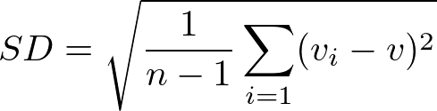
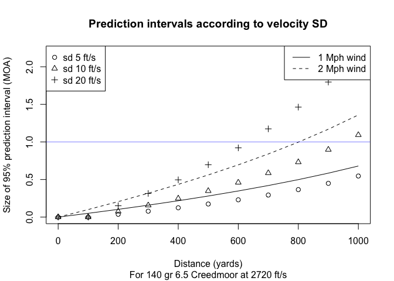

How many rounds are needed to accurately estimate SD?
================

    ## [1] 2905.63

    ## [1] 5.65706

In precision rifle circles **Standard Deviation** (SD) refers to the consistency of the velocity of ammunition. SD is actually a general concept of measuring the variability of any data generating process. It applies to all types of data besides projectile velocities.

Rifle shooters measure SD to determine the consistency of their ammunition. Small SD values mean that velocity is consistent. Large SD values mean that the velocities are inconsistent. Inconsistent velocity manifests itself as vertical stringing at distance. Slower bullets take longer to get to the target and they drop more. As any handloader will tell you, consistency is accuracy.

Let *v**i* be the velocity of the *i*th round, *v* be the average velocity and *n* be the number of rounds fired through a chronograph. Then the unbiased SD for a normal population is given by this formula:

Another common formula divides by n rather than n - 1. This is biased and should be avoided for small samples as used here.

The formula leaves *n* free, which means that we can estimate SD using as few as 2 observations (not recommended). Increasing the number of rounds fired through the chronograph increases the accuracy of the estimate of SD. However, there is tension between *n* and cost. Every round fired requires time to load, money for the components, and wears the barrel.

Question:

> What is the point of diminishing returns? 5 rounds? 7 rounds? Or do I always need to shoot 20?

Answer:

It depends.

First we have to reflect on *why* we care about SD. The only reason it matters for long distance shooting is because of the vertical stringing at distance. We need to know where in the vertical plane we can reasonably expect the rounds to impact so we can use the correct elevation. In particular we need to know what the velocity of the *next* round from a given lot will be, since if we knew this we could use a ballistic calculator to compute an exact solution.

Since we can't possibly know the exact velocity of a round before it is fired we turn to statistics to provide us with reasonable upper and lower bounds based on the data we've observed so far. This is the idea of a [prediction interval](https://robjhyndman.com/hyndsight/intervals/). The quick and dirty formula for a 95% confidence interval is (*v* − 2 \* *S**D*, *v* + 2 \* *S**D*). This means that if the shooter repeats this process many times for many different lots of ammunition then approximately 95% of the predicted velocities will be inside the confidence interval.

For example, if average velocity is 2720 ft/s and SD is 10 ft/s then a 95% confidence interval for the next round is (2700, 2740). For a 140 grain 6.5 Creedmoor this velocity difference translates to a 0.5 MOA vertical spread at 600 yards. So if you have a perfect hold on a perfect gun on a perfect clear day with no wind and you're aiming at the 0.5 MOA X ring on an F class target then you can expect on average 95% or 19 / 20 shots to impact in the vertical region of the X ring.

In reality these other sources of variability are rarely perfect. So if you're competitive then you may well benefit from shrinking SD down from 10 to 5 ft/s to cut your velocity based vertical dispersion in half.

The following charts illustrate the ideas for two common cartridges. All data was generated using the [Hornady 4DOF ballistic calculator](http://www.hornady.com/ballistics-resource/4dof) based on Hornady's ELD Match bullets available in the drop down menu. The effect of a 1 and 2 mph wind is also

Examine this a bit further:

Once the lines flatten out you've reached the area of diminishing returns.

You can't get better than the corresponding normal variance, so it's worth examining the efficiency that you give up by sampling only n points.

Blue lines in the plot show fixed levels of statistical efficiency. Tighter confidence intervals are more efficient. If one is interested in a 95 percent confidence interval then 7 rounds will make 80 percent efficent estimates.

TODO: Translate all this to difference in ballistic tables at 1K yards.

If the rounds are extremely consistent, then one doesn't need particularly efficient statistics, because the standard deviations are so low that the ballistic tables won't change much.
