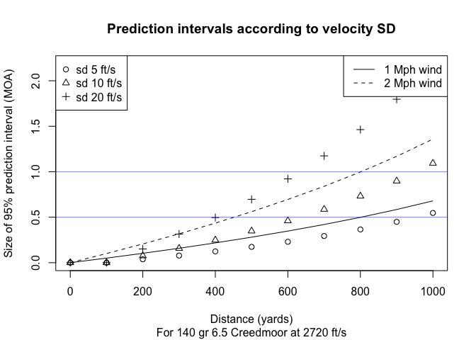

How many rounds are needed to accurately estimate SD?
================

**Standard Deviation** (SD) measures the consistency of the velocity of ammunition. Small SD values mean that velocity is consistent. Large SD values mean that the velocities are inconsistent. Inconsistent velocity manifests itself as vertical stringing at distance. Slower bullets take longer to get to the target and they drop more. As any handloader will tell you, consistency is accuracy.

Firing more round through a chronograph will give you a more accurate estimate of SD. However, Every round fired requires time to load, money for the components, and wears down the barrel. Which brings us to the question this article addresses.

*Question:*

> How many rounds do I need to fire to accurately estimate SD? What is the point of diminishing returns? 5 rounds? 9 rounds?

*Answer:*

**It depends.**

To understand this answer we return to *why* we care about SD. Our goal is to know where in the vertical plane the rounds will impact so we can dial the correct elevation in the scope. In particular we need to know what the velocity of the *next* round from a given lot will be, since if we knew this we could use a ballistic calculator to compute an exact solution.

Since we can't possibly know the exact velocity of a round before it is fired we turn to statistics to provide us with reasonable upper and lower bounds based on the data we've observed so far. This is the idea of a [prediction interval](https://robjhyndman.com/hyndsight/intervals/). If SD is known then a quick and dirty formula for a 95% prediction interval is (*v* − 2 \* *S**D*, *v* + 2 \* *S**D*). This means that if the shooter repeats this process many times for many different lots of ammunition then approximately 95% of the predicted velocities will be inside this interval.

For example, if average velocity is 2720 ft/s and SD is 10 ft/s then a 95% confidence interval for the next round is (2700, 2740). For a 140 grain 6.5 Creedmoor this velocity difference translates to a 0.5 MOA vertical spread at 600 yards. So if you have a perfect hold on a perfect gun on a perfect clear day with no wind and you're aiming at the 0.5 MOA X ring on an F class target then you can expect on average 95% or 19 / 20 shots to impact in the vertical region of the X ring.

In reality these other sources of variability are rarely perfect. So if you're competitive then you may well benefit from shrinking SD down from 10 to 5 ft/s to cut your ammunition's vertical dispersion in half.

The following charts illustrate the ideas for two common cartridges. All data was generated using the [Hornady 4DOF ballistic calculator](http://www.hornady.com/ballistics-resource/4dof) based on Hornady's ELD Match bullets available in the drop down menu. The plot also shows the effect of a 1 and 2 mph cross wind for comparison.

This plot shows the effect of three different SD values for a 6.5 Creedmoor.

Examine this a bit further:

Once the lines flatten out you've reached the area of diminishing returns.

You can't get better than the corresponding normal variance, so it's worth examining the efficiency that you give up by sampling only n points.

Blue lines in the plot show fixed levels of statistical efficiency. Tighter confidence intervals are more efficient. If one is interested in a 95 percent confidence interval then 7 rounds will make 80 percent efficent estimates.

TODO: Avoid data snooping! Ie. first decide how many rounds you will shoot. Seeing nice low values and then stopping early will give you a false sense of confidence.

If the rounds are extremely consistent, then one doesn't need particularly efficient statistics, because the standard deviations are so low that the ballistic tables won't change much.

Technical Details
-----------------

SD is actually a general concept of measuring the variability of data, and has many other applications.

Let *v**i* be the velocity of the *i*th round, *v**b**a**r* be the average velocity and *n* be the number of rounds fired through a chronograph. Then the unbiased SD for a normal population is given by this formula:

Another common formula divides by n rather than n - 1. This is biased and should be avoided for small samples as used here. The formula leaves *n* free, which means that we can estimate SD using as few as 2 observations (not recommended).
