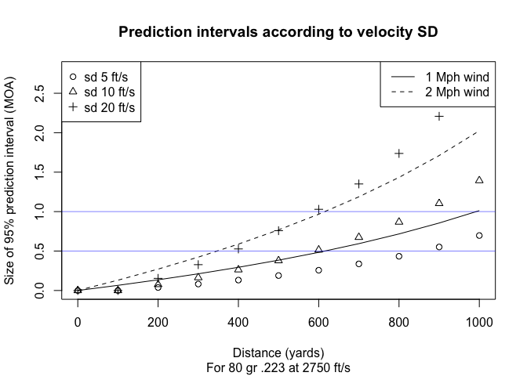

How many rounds are needed to accurately estimate sd?
================

Confidence intervals.

Simulating given real parameters.

``` r
set.seed(793230)

avg_velocity_true = 2900
sd_true = 10
n = 2

obs = rnorm(n, avg_velocity_true, sd_true)

(avg_velocity_estimate = mean(obs))
```

    ## [1] 2905.63

``` r
(sd_estimate = sd(obs))
```

    ## [1] 5.65706

Related question- how many observations are necessary to estimate mean and variance? A **ton** of them!! <https://stats.stackexchange.com/a/7008>

More interesting is a confidence interval for the next round from the lot. This is useful because one can check ballistic tables based on upper and lower bounds.

``` r
read_hornady = function(fname)
{
    # Read a spreadsheet produced by
    # http://www.hornady.com/ballistics-resource/4dof
    out = read.table(fname, header = FALSE, skip = 3L
            , sep = ",", stringsAsFactors = FALSE)
    nm = read.table(fname, sep = ",", skip = 1L, nrows = 2L
            , stringsAsFactors = FALSE)
    with_unit = paste0(nm[1, ], nm[2, ])
    with_unit = gsub("[[:space:]]+$", "", with_unit)
    colnames(out) = with_unit
    out
}

diff = function(hi, low)
{
    hi = read_hornady(hi)
    low = read_hornady(low)
    low[, "ComeUp(MOA)"] - hi[, "ComeUp(MOA)"]
}
```

``` r
ideal = read_hornady("data/6.5_140_2720.csv")
Range = ideal$Range
wind = ideal[, "WindDrift(MOA)"] / 10
sd5 = diff("data/6.5_140_2710.csv", "data/6.5_140_2730.csv")
sd10 = diff("data/6.5_140_2700.csv", "data/6.5_140_2740.csv")
sd20 = diff("data/6.5_140_2680.csv", "data/6.5_140_2760.csv")

plot_sd = function(...)
{
    ylim = range(wind, sd20)
    plot(range(Range), ylim, type = "n"
        , main = "Confidence intervals according to velocity SD"
        , xlab = "Distance (yards)"
        , ylab = "Size of 95% confidence interval (MOA)"
        , ...
        )
    lines(Range, ideal[, "WindDrift(MOA)"] / 10)
    lines(Range, ideal[, "WindDrift(MOA)"] / 5, lty = 2)
    points(Range, sd5)
    points(Range, sd10, pch = 2)
    points(Range, sd20, pch = 3)
    legend("topleft", legend = c("sd 5 ft/s", "sd 10 ft/s", "sd 20 ft/s")
        , pch = 1:3)
    legend("topright", legend = c("1 Mph wind", "2 Mph wind"), lty = 1:2
        , bg = "white")
    abline(h = 1, col = scales::alpha("blue", 0.5))
}

plot_sd(sub = "For 140 gr 6.5 Creedmoor at 2720 ft/s")
```



``` r
ideal = read_hornady("data/223_80_2750.csv")
Range = ideal$Range
wind = ideal[, "WindDrift(MOA)"] / 10
sd5 = diff("data/223_80_2740.csv", "data/223_80_2760.csv")
sd10 = diff("data/223_80_2730.csv", "data/223_80_2770.csv")
sd20 = diff("data/223_80_2710.csv", "data/223_80_2790.csv")

plot_sd(sub = "For 80 gr .223 at 2750 ft/s")
```


``` r
conf_level = 0.95

# This is really the part that matters
tmul = qt(conf_level + (1 - conf_level) / 2, n - 1)

confidence_interval = c(
    lower = avg_velocity_estimate - sd_estimate * tmul,
    upper = avg_velocity_estimate + sd_estimate * tmul)
```

Examine this a bit further:

``` r
n = 2:20

tmul = function(conf_level, .n = n){
    qt(conf_level + (1 - conf_level) / 2, .n - 1)
}

t80 = tmul(0.8)
t90 = tmul(0.9)
t95 = tmul(0.95)
t99 = tmul(0.99)


plot(n, t99, ylim = c(0, 10), type = "l", xlab = "Rounds Fired"
    , ylab = "SD Multiplier", main = "Size of confidence intervals")
lines(n, t95, lty = 2)
lines(n, t90, lty = 3)
lines(n, t80, lty = 4)
legend("topright", legend = c("99", "95", "90", "80"), lty = 1:4)
```


Once the lines flatten out you've reached the area of diminishing returns.

You can't get better than the corresponding normal variance, so it's worth examining the efficiency that you give up by sampling only n points.

``` r
n = 2:15

relative_efficiency = function(conf_level, .n = n){
    lowerbound = qnorm(conf_level + (1 - conf_level) / 2)
    lowerbound / tmul(conf_level, .n)
}

e80 = relative_efficiency(0.8)
e90 = relative_efficiency(0.9)
e95 = relative_efficiency(0.95)
e99 = relative_efficiency(0.99)


plot(n, e99, ylim = c(0, 1), type = "l", xlab = "Rounds Fired"
    , ylab = "Relative Efficiency"
    , main = "relative efficiency based on confidence level")
lines(n, e95, lty = 2)
lines(n, e90, lty = 3)
lines(n, e80, lty = 4)
abline(h = c(0.5, 0.8, 0.9), col = scales::alpha("blue", 0.5))
legend("bottomright", legend = c("99", "95", "90", "80"), lty = 1:4)
```


Blue lines in the plot show fixed levels of statistical efficiency. Tighter confidence intervals are more efficient. If one is interested in a 95 percent confidence interval then 7 rounds will make 80 percent efficent estimates.

TODO: Translate all this to difference in ballistic tables at 1K yards.

If the rounds are extremely consistent, then one doesn't need particularly efficient statistics, because the standard deviations are so low that the ballistic tables won't change much.
